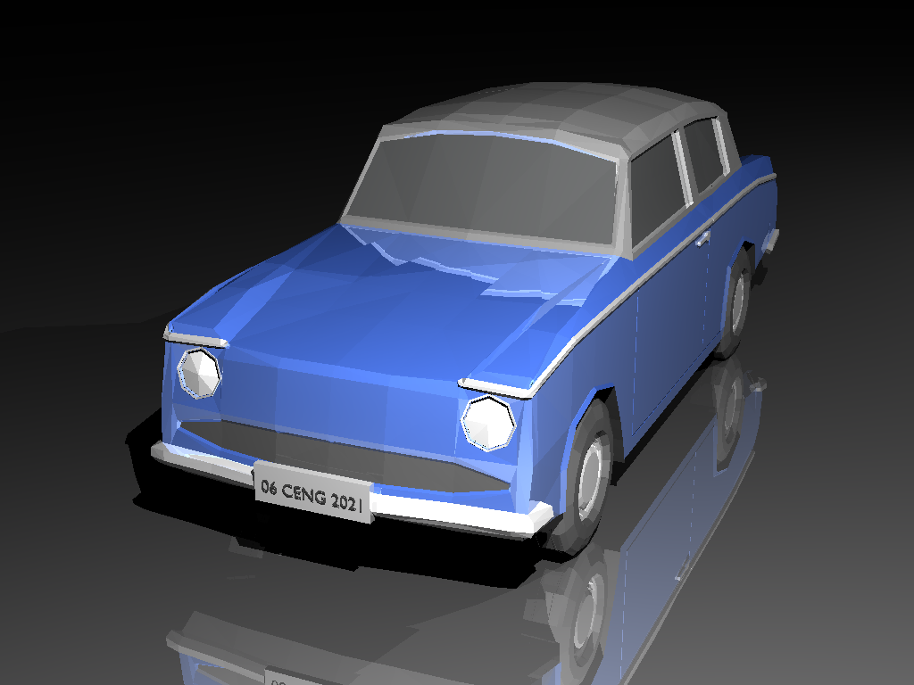

# Raytracer-Renderer-CGI

Ray tracing is a fundamental rendering algorithm. It is commonly used for animations and architectural simulations, 
in which the quality of the created images is more important than the time it takes to create them. 
It simulates the propagation of light in real world. 

Keywords: ray tracing, light propagation, geometric optics, ray-object intersections, surface shading

The scene file will be formatted as an XML file. In this file, there may be different numbers of materials, vertices, triangles, spheres, lights, and cameras. Each of these are defined by a unique integer ID. The IDs for each type of element will start from one and increase sequentially. Also notice that, in the XML file: · Every number represented by X, Y and Z is a floating point number. · Every number represented by R, G, B, and N is an integer.

Basic illumination model is used in this project. Ambient, Diffuse and Specular components are added. Bling phong shading is used as well. To limit the rendering time back face culling is implemented.

# Some rendered images





# Run 

Change the input image to render different images. Bare in mind that raytracing takes time.Depending on your computer some image renderings take upto 30 - 50 minutes  
```
cd code_template
make 
./raytracer sample_scenes_v3/inputs/simple.xml
./raytracer sample_scenes_v3/inputs/simple_reflectance.xml
./raytracer sample_scenes_v3/inputs/simple_shading.xml
./raytracer sample_scenes_v3/inputs/bunny.xml
./raytracer sample_scenes_v3/inputs/berserker.xml
./raytracer sample_scenes_v3/inputs/car.xml
./raytracer sample_scenes_v3/inputs/cornellbox.xml
./raytracer sample_scenes_v3/inputs/dragon_lowres.xml
./raytracer sample_scenes_v3/inputs/horse_and_mug.xml
./raytracer sample_scenes_v3/inputs/killeroo.xml
./raytracer sample_scenes_v3/inputs/low_poly.xml
./raytracer sample_scenes_v3/inputs/mirror_spheres.xml
./raytracer sample_scenes_v3/inputs/monkey.xml
```
